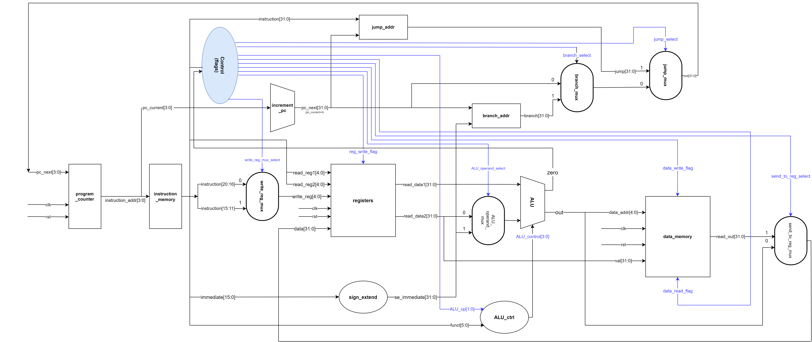

# single-cycle-processor

References: 
https://student.cs.uwaterloo.ca/~isg/res/mips/opcodes 
https://www.cs.fsu.edu/~zwang/files/cda3101/Fall2017/Lecture5_cda3101.pdf 
https://inst.eecs.berkeley.edu/~cs61c/fa14/lec/27/2014Fa-CS61C-L27-sc-CPU-1up.pdf
